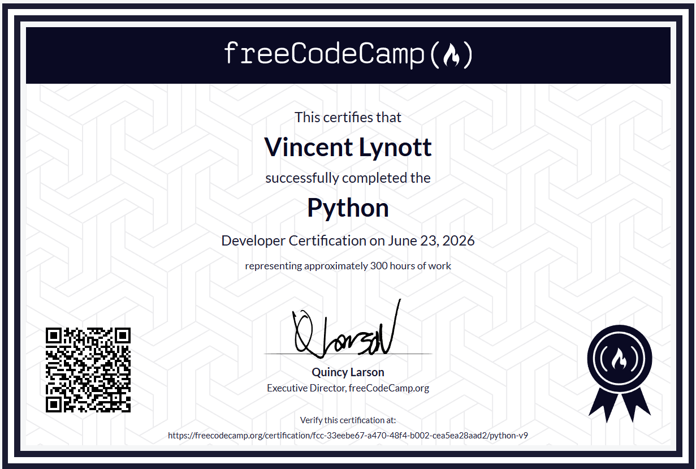

# Hi, I'm Vincent Lynott 👋

I'm a Software Development and Design student pursuing an Associate of Applied Science (AAS). I enjoy building software, working with backend systems, developing applications, and creating tools for games and online platforms.

I started programming through game development and have since expanded my skills into software development, Android applications, APIs, databases, web development, and custom server systems.

## 🎓 About Me

- AAS Software Development and Design student
- Interested in software engineering, backend development, and application development
- Experience building Android applications
- Background in Unreal Engine and game development
- Experience developing PocketMine-MP plugins, server systems, and custom tools using PHP
- Experience deploying websites and applications using Vercel and Netlify

## 🛠️ Technologies & Tools

- Python
- Java
- JavaScript
- PHP
- Android Development
- HTML & CSS
- REST APIs
- Databases
- Git & GitHub
- Vercel
- Netlify
- Unreal Engine
- PocketMine-MP Development

## 🚀 Projects

- Android applications
- PocketMine-MP plugins and custom server systems
- Web applications and deployed projects
- Game development projects
- Personal software projects and experiments

## 📚 Currently Learning

- Full-stack development
- Database design
- API development
- Software architecture
- Improving application design and development skills

## 🏆 Certifications

### freeCodeCamp

**Python Developer Certification**  
Issued June 2026 • Approximately 300 hours of coursework

## 🎯 Goals

My goal is to continue improving as a developer, build useful software, and pursue a career in software engineering.

## 👀 Visitors

## 📫 Contact

- Discord: **@lynottt**
